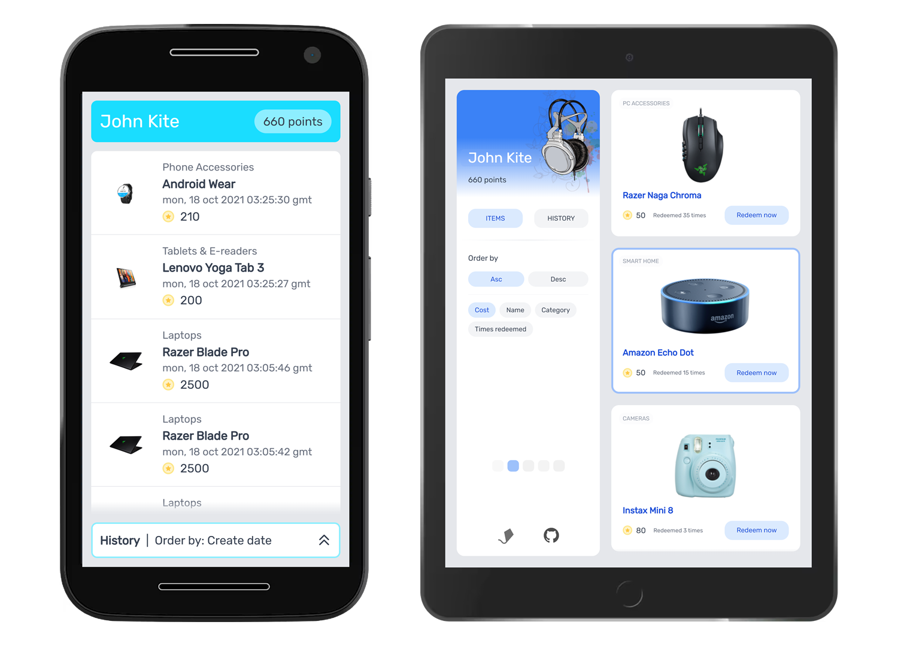

# Loyalty app (aerolab.co challenge)

## [Live demo](https://loyalty-app-aerolab.web.app/)

## [Challenge](https://aerolab.co/coding-challenge-instructions?utm_campaign=Coding%20Challenge)

## [API](https://aerolabchallenge.docs.apiary.io/#reference/0/products/get)

## Descripción

Challenge realizado para aerolab.co

La aplicación esta desarrollada con vite.js, vue, vue router, vuex, tailwindcss con modo JIT, y desplegada con firebase hosting como SPA.

Características principales:

- Componentes completamente hechos desde cero, sin librerías
- Grilla dinámica con js, se adapta a cualquier tamaño de pantalla
- Comportamiento de grilla para pantallas grandes, y scroll para mobile
- Paginado en la sección de ítems e historial
- Selección de theme color que queda guardada en el localStorage
- Criterios de ordenamiento para todas las propiedades de los objetos
- Placeholder para carga de imágenes
- Opengraph metadata
- Loadings y catch de errores en todas las operaciones asíncronas

## Capturas




## Correr en modo dev

```shell
npm i

npm run tw
npm run dev
```

## Compilar

```shell
npm run tw:build
npm run build

npm run serve
```
